# Resumo das Análises das Imagens

## Imagem: 1_acessar_configuracoes.png

### Abrir configurações do Speech Studio
Clicar no ícone de engrenagem (Settings) localizado na barra superior à direita.

- Ícone selecionado: engrenagem destacada em vermelho.

## Imagem: 2_criar_novo_recurso.png
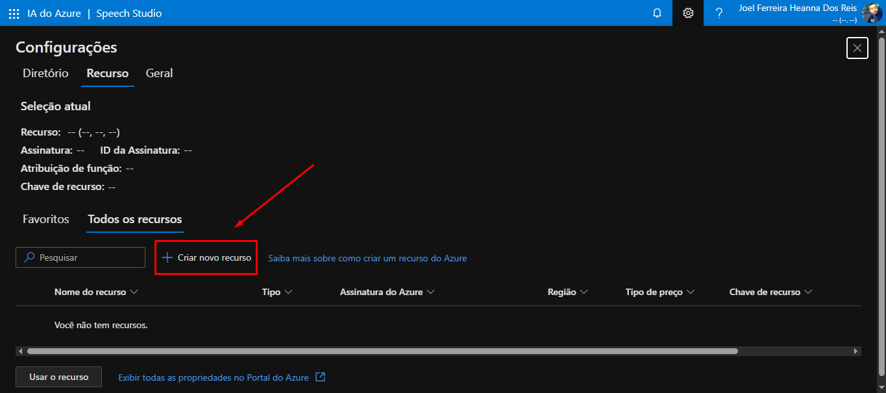

### Clicar em "Criar novo recurso"
Clicar no botão "+ Criar novo recurso" na aba "Recursos" para iniciar a criação de um recurso do Azure.

- Local: aba "Todos os recursos" dentro de Configurações > Recurso.
- Botão: "+ Criar novo recurso" (ao lado do campo de pesquisa).
- Resultado esperado imediato: abertura do fluxo de criação de recurso no Portal/Azure Speech Studio.

## Imagem: 3_criar_recurso_fala.png
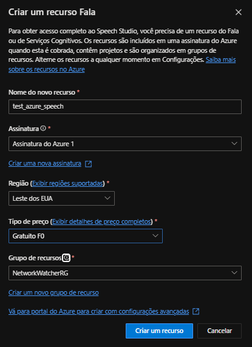

### Preencher formulário e criar recurso Fala
Preencher os campos do formulário de criação do recurso Speech e clicar em "Criar um recurso".

- Nome do novo recurso: test_azure_speech
- Assinatura: Assinatura do Azure 1
- Região: Leste dos EUA
- Tipo de preço: Gratuito F0
- Grupo de recursos: NetworkWatcherRG
- Ação final: clicar em "Criar um recurso" para submeter a criação.

## Imagem: 4_recursos_criados_em_uso.png

### Selecionar recurso e abrir para uso
Selecionar o recurso listado e clicar em "Usar o recurso" para abrir/usar esse recurso no Speech Studio.

- Recurso selecionado: aiassistspeech (linha marcada).
- Botão clicado: "Usar o recurso" (canto inferior esquerdo).
- Ação alternativa visível: fechar a janela de configurações clicando no botão "X" no canto superior direito.

## Imagem: 5_selecionar_modelo.png

### Selecionar "Conversão de fala em texto em tempo real"
Clicar no cartão "Conversão de fala em texto em tempo real" destacado em vermelho.

- Clicar no link/área "Experimente o Conversão de fala em texto em tempo real" dentro do cartão para iniciar a experiência.

## Imagem: 6_configuracoes_modelo.png

### Selecionar opções da experiência "Conversão de fala em texto em tempo real"
Selecionar os recursos e configurações para testar a conversão de fala em tempo real.

- Botões disponíveis para abrir material de apoio:
  - Clicar em "Ver a documentação"
  - Clicar em "Exibir exemplo de código"
  - Clicar em "Usar o CLI de Fala"
- Escolher plataforma de implantação:
  - Opções visíveis: "Contêiner do Docker" e "Nuvem"
- Usar com o seu recurso:
  - Marcar a caixa de reconhecimento de uso do recurso (já marcada na imagem)
  - Selecionar idioma no campo "Escolher um idioma" (ex.: "Inglês (Estados Unidos)")
  - Opcional: clicar em "Mostrar as opções avançadas" para acessar configurações adicionais

## Imagem: 7_playground_modelo.png

### Fazer upload ou gravar áudio para teste
Arrastar e soltar o(s) arquivo(s) de áudio na área indicada ou clicar em "Procurar arquivos..." para selecionar localmente; como alternativa, clicar no ícone de microfone para gravar áudio diretamente.

- Área de envio: "Arraste e solte o(s) arquivo(s) de áudio aqui" ou "Procurar arquivos..."
- Gravação: botão de microfone para iniciar gravação.
- Após envio, os arquivos carregados aparecem na caixa "Arquivos de áudio".
- Os resultados da conversão aparecerão no painel "Resultados de teste" à direita.

## Imagem: 8_resultado_audio_para_texto.png
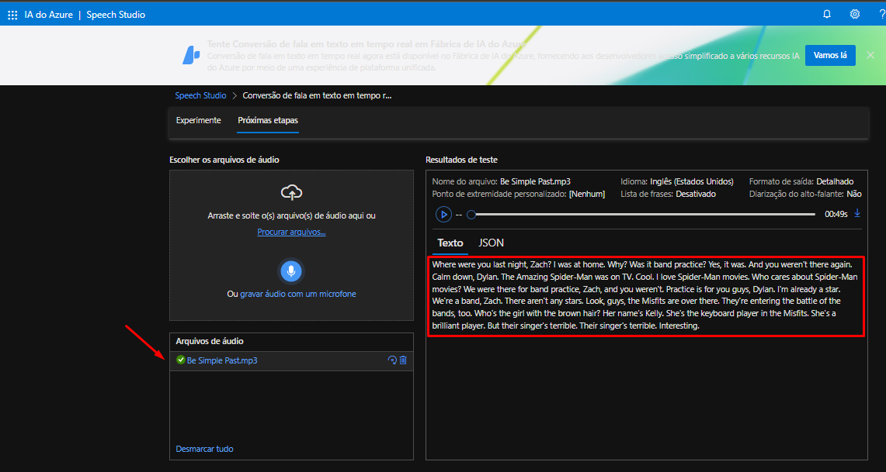

### Selecionar arquivo de áudio carregado
Clicar no arquivo de áudio listado em "Arquivos de áudio" (Be Simple Past.mp3) para carregar/selecionar o arquivo para teste.

- Arquivo selecionado: Be Simple Past.mp3 (aparece com ícone de status e nome destacado).
- Resultado imediato: transcrição do áudio exibida no painel "Resultados de teste" na aba "Texto".
- Informações visíveis no painel de resultados:
  - Idioma: Inglês (Estados Unidos)
  - Formato de saída: Detalhado
  - Duração mostrada: 00:49s
- Controles disponíveis no painel: botão de reprodução e barra de progresso para ouvir o áudio.

## Imagem: 9_proximas_etapas_introducao.png
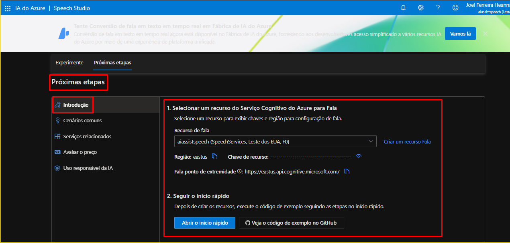

### Selecionar recurso de Serviço Cognitivo de Fala e abrir início rápido
Selecionar o recurso de Fala no campo "Recurso de fala" e acessar o material de suporte.

- Campo preenchido: "aiassistspeech (SpeechServices, Leste dos EUA, F0)" selecionado no dropdown "Recurso de fala".
- Informações visíveis a consultar: Região (eastus), Chave de recurso (oculta) e URL de endpoint (https://eastus.api.cognitive.microsoft.com/).
- Ações disponíveis:
  - Clicar em "Abrir o início rápido" para seguir o passo a passo de configuração/exemplos.
  - Ou clicar em "Veja o código de exemplo no GitHub" para acessar exemplos de código.
- Opção alternativa: clicar em "Criar um recurso Fala" para criar um novo recurso caso necessário.

## Imagem: 10_proximas_etapas_cenarios_cumuns.png
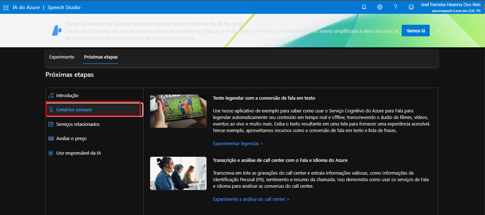

### Selecionar "Cenários comuns"
Clicar no item de menu "Cenários comuns" na coluna lateral esquerda.

- Item destacado: "Cenários comuns" com contorno vermelho.
- Resultado imediato visível: painel à direita exibe opções como "Tente legendar com a conversão de fala em texto" e "Transcrição e análise de call center com o Fala e Idioma do Azure".

## Imagem: 11_proximas_etapas_servicos_relacionados.png

### Selecionar "Serviços relacionados"
Clicar no item "Serviços relacionados" na coluna lateral esquerda para abrir o painel de serviços associados.

- Painel à direita exibe as opções/links:
  - Fala Personalizada — link "Iniciar um projeto de Fala Personalizada"
  - Galeria de Serviço de Voz — link "Explorar a Galeria de Vozes"
  - Avaliação de Pronúncia — link "Experimente a Avaliação de Pronúncia"

## Imagem: 12_proximas_etapas_avaliar_preco.png

### Selecionar "Avaliar o preço" e abrir opções de cotação
Clicar no item "Avaliar o preço" na coluna lateral esquerda para exibir o painel de preços à direita.

- Painel exibido: "Preço padrão para fala em texto" com links para "Preços dos serviços do Fala do Azure" e "Calculadora de preços do Azure".
- Ação disponível e destacada: clicar no botão azul "Converse com um especialista de vendas" para solicitar cotação ou esclarecer dúvidas sobre preços.

## Imagem: 13_proximas_etapas_uso_responsavel_ia.png

### Selecionar "Uso responsável da IA"
Clicar no item "Uso responsável da IA" na coluna lateral esquerda para abrir o painel com diretrizes de uso responsável.

- Item selecionado: "Uso responsável da IA" (destacado em vermelho).
- Resultado imediato: painel à direita exibe o título "Uso responsável da IA", texto sobre princípios éticos e dois links:
  - "Uso responsável da IA com os Serviços Cognitivos"
  - "Princípios de IA da Microsoft"

## Imagem: 14_Portal_azure_servico_inicial.png
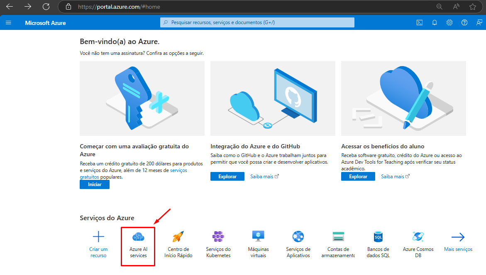

### Abrir "Azure AI services"
Clicar no ícone/atalho "Azure AI services" na seção "Serviços do Azure" na parte inferior da página.

- Local: linha de ícones em "Serviços do Azure".
- Elemento clicado: cartão com o rótulo "Azure AI services" (destacado em vermelho).

## Imagem: 15_Portal_azure_servico_linguagem.png
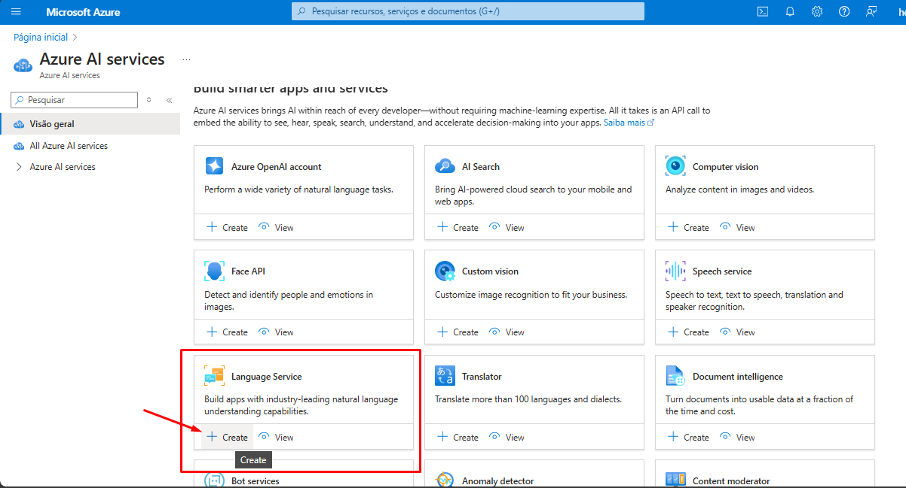

### Criar recurso "Language Service"
Clicar no botão "Create" dentro do cartão "Language Service".

- Cartão: "Language Service" (Build apps with industry-leading natural language understanding capabilities).
- Botão clicado: "+ Create" localizado abaixo do título do cartão.

## Imagem: 16_Portal_azure_funcoes_criacao.png

### Continuar para criar o recurso
Clicar no botão "Continue to create your resource" localizado no canto inferior esquerdo.

- Botão destacado em vermelho com seta indicando ação.
- Ação imediata: avançar para a próxima etapa do fluxo de criação do recurso.

## Imagem: 17_Portal_azure_criar_idioma.png
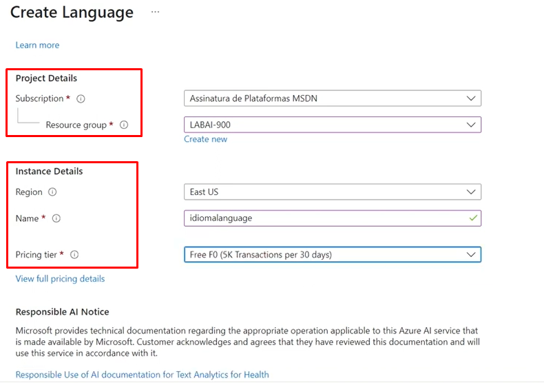

### Preencher detalhes do projeto e da instância
Selecionar assinatura e grupo de recursos e configurar região, nome e tipo de preço do recurso Language.

- Subscription: escolher "Assinatura de Plataformas MSDN".
- Resource group: selecionar "LABAI-900" (opção "Create new" disponível).
- Region: selecionar "East US".
- Name: inserir "idiomalanguage".
- Pricing tier: selecionar "Free F0 (5K Transactions per 30 days)".

## Imagem: 18_Portal_azure_criar_idioma_2.png

### Marcar termo de responsabilidade (Responsible AI Notice)
Marcar a caixa de seleção para certificar que você revisou e reconhece os termos do Responsible AI Notice.

- Caixa marcada: botão de seleção ao lado do texto "By checking this box I certify that I have reviewed and acknowledge the terms in the Responsible AI Notice." (seta vermelha apontando para a caixa).

## Imagem: 19_Portal_azure_validacao_create.png
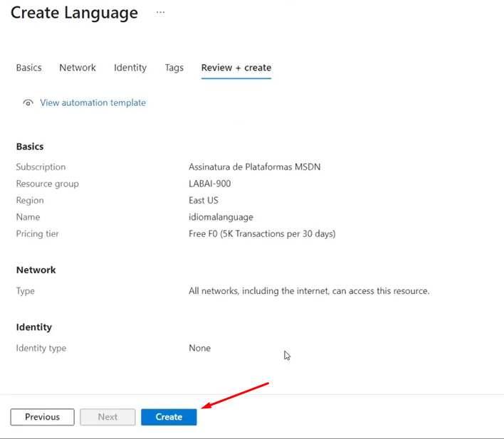

### Confirmar e criar recurso Language
Clicar no botão "Create" para submeter a criação do recurso Language.

- Campos exibidos (confirmação antes de criar):
  - Subscription: Assinatura de Plataformas MSDN
  - Resource group: LABAI-900
  - Region: East US
  - Name: idiomalanguage
  - Pricing tier: Free F0 (5K Transactions per 30 days)
- Rede: All networks, including the internet, can access this resource.
- Identity type: None

## Imagem: 20_azure_studio_select_resources.png
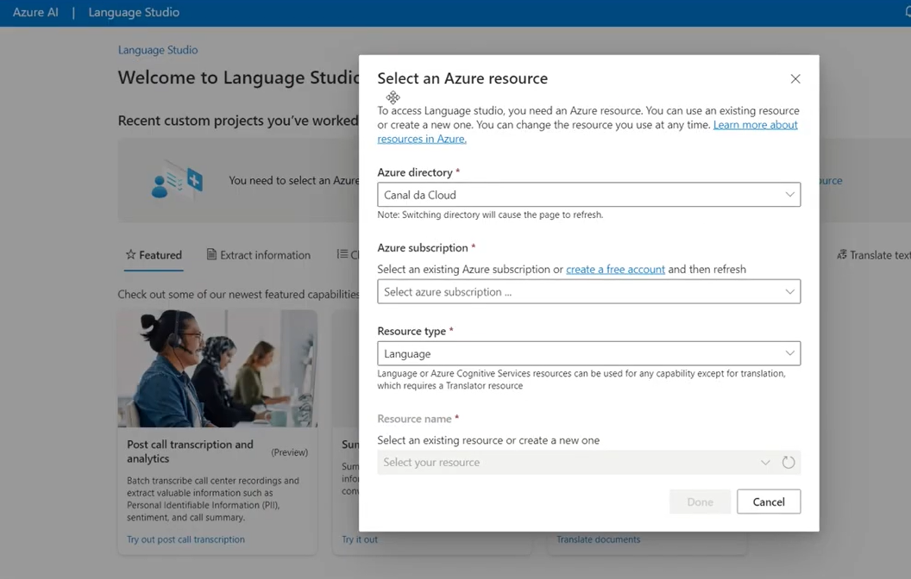

### Selecionar um recurso do Azure para o Language Studio
Preencher/selecionar os campos do diálogo "Select an Azure resource" para associar um recurso ao Language Studio.

- Azure directory: selecionado "Canal da Cloud".
- Azure subscription: campo aberto com placeholder "Select azure subscription ..." (sem assinatura selecionada).
- Resource type: selecionado "Language".
- Resource name: dropdown com placeholder "Select your resource" (sem recurso selecionado).
- Ações disponíveis: botão "Cancel" ativo; botão "Done" desativado até que uma assinatura e/ou recurso sejam selecionados.

## Imagem: 21_azure_studio_criar_nova_solucao.png
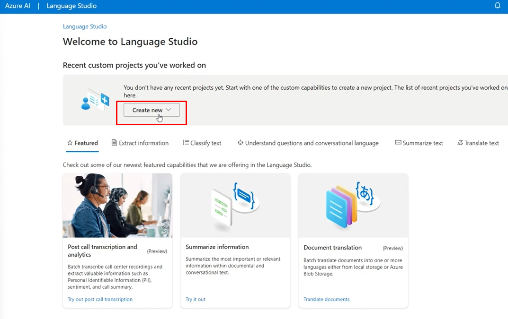

### Clicar em "Create new"
Clicar no botão "Create new" localizado na seção "Recent custom projects you've worked on" para iniciar a criação de um novo projeto.

- Local: botão "Create new" centralizado abaixo do texto informativo.
- Ação visível: clique no botão (cursor sobre o botão).

## Imagem: 22_azure_studio_select_resources_done.png

### Confirmar seleção do recurso e finalizar
Clicar no botão "Done" para confirmar o recurso selecionado e associá‑lo ao Language Studio.

- Campos visíveis e já selecionados:
  - Azure directory: Canal da Cloud
  - Azure subscription: Assinatura de Plataformas MSDN
  - Resource type: Language
  - Resource name: idiomalanguage
  - Pricing tier: Free (F0)
  - Managed identity: Enabled

## Imagem: 23_azure_studio_-recursos_disponiveis.png
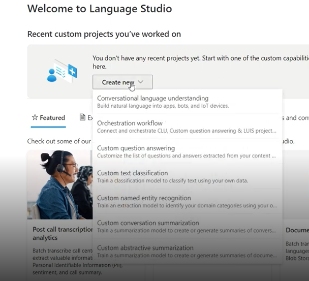

### Clicar em "Create new" e selecionar o tipo de projeto
Clicar no botão "Create new" e escolher a opção "Conversational language understanding" no menu suspenso.

- Botão clicado: "Create new" (menu aberto).
- Opção selecionada: "Conversational language understanding" (primeira opção do menu).

## Imagem: 24_azure_studio_-escolha_modelo.png

### Selecionar "Classify text" e abrir "Analyze sentiment and mine opinions"
Clicar na aba "Classify text" (destaque superior) e em seguida clicar no cartão "Analyze sentiment and mine opinions".

- Aba selecionada: "Classify text" (botão superior marcado).
- Cartão escolhido: "Analyze sentiment and mine opinions".
- Ação no cartão: clicar em "Try it out" para abrir a experiência de análise de sentimento.

## Imagem: 25_azure_studio_digitar_mensagem.png
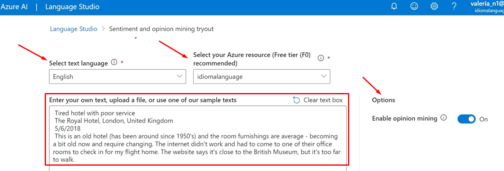

### Selecionar idioma, recurso e inserir texto para análise de sentimento
Selecionar idioma do texto, escolher o recurso Azure associado e inserir o texto a ser analisado.

- Campo "Select text language": selecionar "English".
- Campo "Select your Azure resource": selecionar "idiomalanguage".
- Caixa de texto central: colar ou digitar o texto de entrada (ex.: trecho de avaliação do hotel já preenchido).
- Opção "Enable opinion mining": confirmar que o toggle está em "On".

## Imagem: 26_azure_studio_run_model.png

### Marcar consentimento de custos e executar a demo
Marcar a caixa de seleção "I acknowledge that running this demo will incur usage and may incur costs to my Azure resource" e clicar no botão "Run" para iniciar a execução da análise.

- Caixa marcada: confirmação de entendimento sobre possíveis custos (texto ao lado da checkbox).
- Botão clicado: "Run".
- Resultado imediato visível: seção "Examine the results" com abas "Result" e "JSON" pronta para exibir os resultados da análise.

## Imagem: 27_azure_studio_resultado1.png
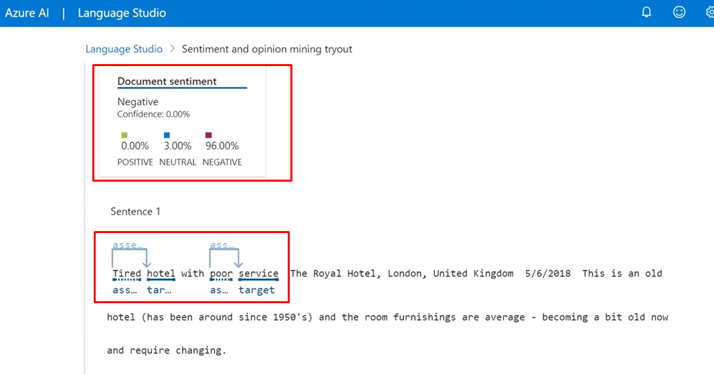

### Resultado da análise de sentimento do documento
Documento classificado como "Negative" com os seguintes valores exibidos:
- Confidence: 0.00%
- Positive: 0.00%
- Neutral: 3.00%
- Negative: 96.00%

- Seção "Sentence 1" com marcações de opinion mining:
  - Trecho destacado: "Tired hotel with poor service"
  - Anotações visíveis (labels truncados): caixas e setas azuis apontando para partes da frase, com rótulos iniciando "ass..." e "as... target", indicando extração de aspectos/opiniões relacionados aos termos "hotel" e "service".

## Imagem: 28_azure_studio_resultado2.png

### Verificar resultado de Sentiment e Opinion Mining
Confirmar o sentimento da sentença e as opiniões extraídas pelo modelo.

- Sentimento da sentença: Negative; Confidence: 0.00%.
- Distribuição exibida: Positive 0.00%, Neutral 1.00%, Negative 98.00%.
- Opiniões extraídas (cards à direita):
  - Target: hotel — Assessment: Tired (negative, 99.00%).
  - Target: service — Assessment: poor (negative, 99.00%).
- Texto original anotado: frase "Tired hotel with poor service" com marcações de aspectos/opiniões.
- Outras sentenças listadas: "Sentence 2" e "Sentence 3" (itens visíveis para navegação).

## Imagem: 29_azure_studio_resultado3.png
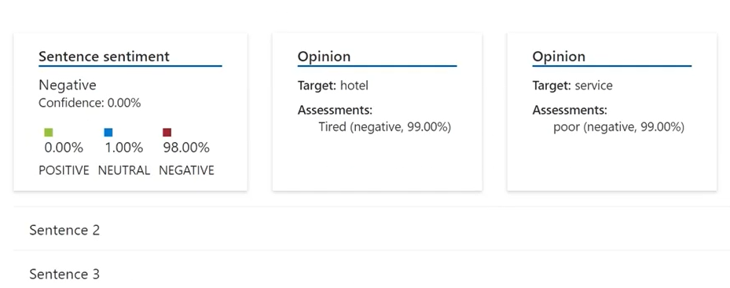

### Conferir resultados de Sentiment e Opinion Mining
Confirmar as classificações exibidas pelo modelo no painel de resultados.

- Sentimento do documento/sentença principal: Negative; Confidence: 0.00%.
- Distribuição de probabilidade: Positive 0.00%, Neutral 1.00%, Negative 98.00%.
- Opiniões extraídas (cards à direita):
  - Target: hotel — Assessment: Tired (negative, 99.00%).
  - Target: service — Assessment: poor (negative, 99.00%).
- Navegação entre sentenças disponível: "Sentence 2" e "Sentence 3" listadas abaixo.

## Imagem: 30_azure_studio_resultado4.png

### Identificar aspecto e avaliação extraídos pelo modelo
Selecionar trecho anotado onde o modelo identificou um target e sua avaliação.

- Target destacado: "internet" (sublinhado/rotulado como target).
- Avaliação relacionada: label "assessment" apontando para a avaliação do target (seta conectando a label ao termo).
- Trecho do texto visível próximo às anotações: "The internet didn't work".

## Imagem: 31_azure_proximos_passos.png

### Selecionar recurso de Language e abrir o início rápido
Selecionar o recurso de Language no campo “Resource for Language service” e acessar o material de suporte.

- Campo selecionado: Resource for Language service = idiomalanguage (dropdown).
- Informações visíveis:
  - Region: eastus
  - Subscription key: chave oculta com ícone para mostrar/copiar
  - Language endpoint: https://idiomalanguage.cognitiveservices.azure.com/
- Ações disponíveis:
  - Clicar em "Open the quick start" para abrir o guia passo a passo.
  - Opcional: clicar em "View samples on GitHub" para ver exemplos de código.

## Imagem: 32_azure_analise_codigo.png

### Clicar em "Get SDK" para obter o SDK e exemplos de código
Clicar no botão azul "Get SDK" na seção "1. Get SDK & Code samples" para baixar/abrir o SDK e exemplos de código.

- Botão principal: "Get SDK" (azul, à esquerda de "View samples on GitHub").
- Opção alternativa visível: botão "View samples on GitHub" (branco) para acessar exemplos no repositório.
- Informação complementar visível: seção "2. Use the code in your own environment" com instrução sobre uso em ambiente de desenvolvimento e ícone "Copy" no canto inferior direito para copiar trechos de código.

## Imagem: 33_azure_cobranca.png
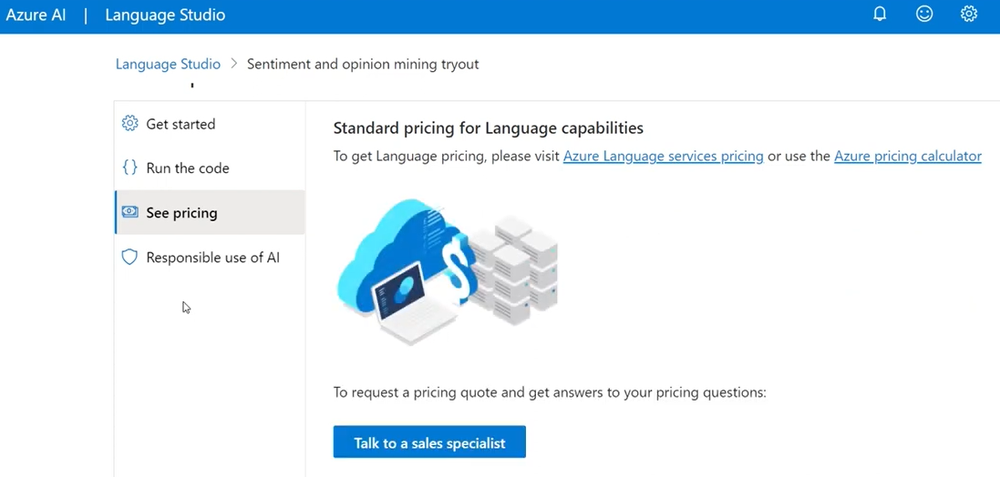

### Selecionar "See pricing"
Clicar no item "See pricing" na coluna lateral esquerda para abrir o painel de preços do serviço Language.

- Painel direito exibido: título "Standard pricing for Language capabilities".
- Links disponíveis: "Azure Language services pricing" e "Azure pricing calculator".
- Ação destacada: botão azul "Talk to a sales specialist" para solicitar cotação ou esclarecimentos.

## Imagem: 34_azure_resposabilidade.png

### Selecionar "Responsible use of AI"
Clicar no item "Responsible use of AI" na coluna lateral esquerda para abrir o painel com diretrizes.

- Painel exibido com o título "Responsible use of AI" e texto descritivo sobre princípios éticos.
- Links visíveis para consulta:
  - "Responsible use of AI with Cognitive Services"
  - "Microsoft's AI principles"

## Imagem: taxas.png
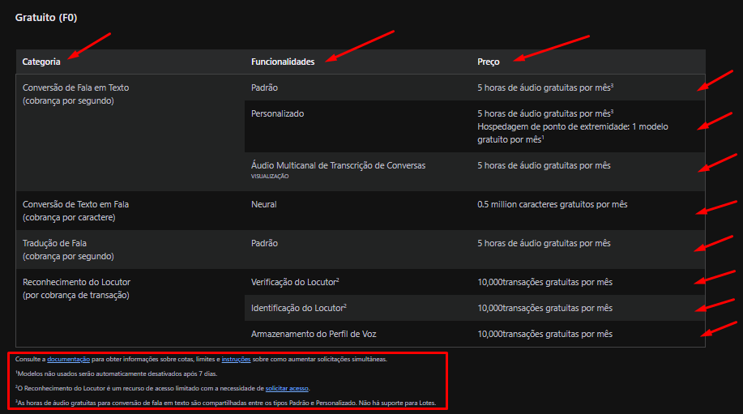

### Visualizar tabela de preços do plano Gratuito (F0)
Consultar as categorias, funcionalidades e valores oferecidos no plano "Gratuito (F0)" exibidos na tabela.

- Colunas principais mostradas: Categoria, Funcionalidades, Preço.
- Itens e preços visíveis:
  - Conversão de Fala em Texto
    - Funcionalidades: Padrão, Personalizado, Áudio Multicanal de Transcrição de Conversas
    - Preço: 5 horas de áudio gratuitas por mês (observação de hospedagem de ponto de extremidade e 1 modelo gratuito por mês para a opção Personalizado)
  - Conversão de Texto em Fala
    - Funcionalidade: Neural
    - Preço: 0.5 milhão caracteres gratuitos por mês
  - Tradução de Fala
    - Funcionalidade: Padrão
    - Preço: 5 horas de áudio gratuitas por mês
  - Reconhecimento do Locutor (por transação)
    - Funcionalidades: Verificação do Locutor, Identificação do Locutor, Armazenamento do Perfil de Voz
    - Preço: 10.000 transações gratuitas por mês (cada funcionalidade listada com esse valor)
- Observações de rodapé visíveis:
  - Link para consultar a documentação para informações sobre cotas, limites e instruções.
  - Avisos: modelos não usados são desativados após 7 dias; reconhecimento do locutor é recurso de acesso limitado; horas de áudio gratuitas para conversão de fala em texto são compartilhadas entre os tipos Padrão e Personalizado e não há suporte para Lotes.

